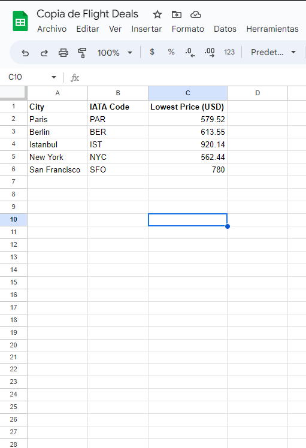

# Flight_Finder

## What is this project about? 
This project consists of a program that searches for the best airline ticket prices in a series of routes stored in a Google Sheet.

## Built with: 

- [Python](https://www.python.org/)
- [Sheety](https://sheety.co/)
- [Amadeus](https://developers.amadeus.com/)

## Author 

👤 **Enzo**
​

- Github: [@enzolonghi](https://github.com/enzolonghi)

- Linkedin: [Enzo Longhi](https://www.linkedin.com/in/enzolonghi/)

## Show your support

Give a ⭐️ if you like this project!
​

## Acknowledgments

- [Angela Yu](https://gist.github.com/angelabauer)
